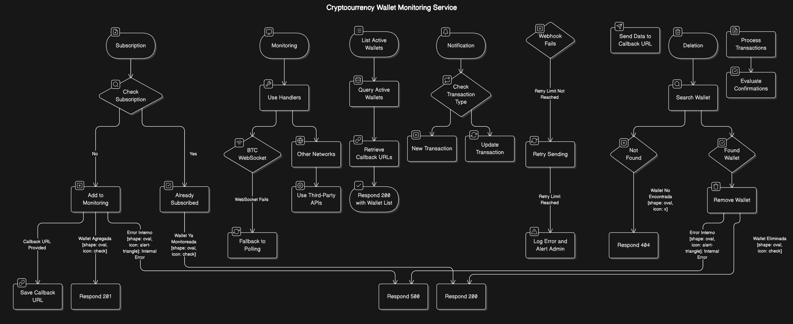

# 🚀 **CryptoMoneytor**

### 🧐 **El Vigilante de Pagos en Criptomonedas**
**CryptoMoneytor** es un servicio modular, escalable y de alto rendimiento diseñado para monitorear transacciones entrantes en múltiples redes blockchain en tiempo real. Su misión es ayudarte a **rastrear fondos**, **detectar eventos clave** y **recibir notificaciones precisas** con un esquema uniforme y flexible. Este servicio permite construir el mecanismo para el IPN (Instant Payment Notifications) y así habilitar un gateway de pagos en criptomonedas. 

Con soporte para redes como **TRON (TRX, USDT)**, **Ethereum (ERC20)**, **Polygon (USDT)**, **Ripple (XRP)**, **BNB Smart Chain**, **Arbitrum**, y **Bitcoin (BTC)**, **CryptoMoneytor** es la herramienta que necesitas para mantener tus transacciones bajo control.

---

## 📋 **Tabla de Contenidos**

1. [Descripción General](#descripción-general)  
2. [Características Principales](#características-principales)  
3. [Estructura del Proyecto](#estructura-del-proyecto)  
4. [Configuración y Ejecución](#configuración-y-ejecución)  
5. [Despliegue con Docker Compose](#despliegue-con-docker-compose)  
6. [Soporte de Redes Blockchain](#soporte-de-redes-blockchain)  
7. [Usando la API](#usando-la-api)  
8. [Optimización y Uso de Recursos](#optimización-y-uso-de-recursos)  
9. [Documentación Swagger](#documentación-swagger)  
10. [Contribuciones](#contribuciones)  
11. [Licencia](#licencia)  

---

## 🧐 **Descripción General**

**CryptoMoneytor** actúa como un **vigilante de tus transacciones cripto**. Diseñado con una arquitectura modular, monitorea wallets en tiempo real y envía notificaciones mediante webhooks cuando ocurren eventos importantes, como:
- **Nuevas transacciones** (`new_transaction`).
- **Actualizaciones de confirmaciones** (`update_transaction`).
- **Confirmaciones completas** (`confirmed_transaction`).

El servicio es altamente **escalable** y puede integrarse fácilmente en aplicaciones financieras, exchanges y plataformas de monitoreo.

---

## 🌟 **Características Principales**

- **Soporte Multi-Blockchain**  
  Redes soportadas: **TRON (TRX, USDT)**, **Ethereum (ERC20)**, **Polygon (USDT)**, **Ripple (XRP)**, **BNB Smart Chain**, **Arbitrum**, y **Bitcoin (BTC)**.

- **Esquema Uniforme de Webhooks**  
  Permite definir un callback URL por wallet o usar una URL genérica de entorno.  
  **Ejemplo de payload**:
  ```json
  {
    "wallet": "0xTuWallet",
    "event": "new_transaction",
    "data": {
      "txID": "abcd1234",
      "amount": "10",
      "amountUSD": "20",
      "coin": "USDT",
      "coinfirmed": false,
      "confirmations": 2,
      "address": "0xFromAddress",
      "fee": "0.001",
      "network": "TRON",
      "sowAt": "2024-12-18T10:00:00.000Z",
      "type": "CRD"
    }
  }


- **Conversión a USD en Tiempo Real:**
  Calcula automáticamente el equivalente en USD para cada transacción utilizando APIs externas.

- **Optimización con Redis:**
  - Caché en Redis para compartir entre instancias.
  - Fallback en memoria local para resiliencia.

- **Suscripción WebSocket para BTC:**
  Monitoreo en tiempo real, con fallback a polling si se pierde la conexión WebSocket.

---

## 📂 **Estructura del Proyecto**

```plaintext
CryptoMoneytor/
│
├── app/                     # Código principal de la aplicación
│   └── index.js             # Punto de entrada del servidor
│
├── config/                  # Configuraciones generales de la aplicación
│   ├── redis.js             # Configuración de Redis
│   ├── apiKeys.js           # Claves API para redes blockchain
│   └── swagger.json         # Definición de la API (Swagger)
│
├── helpers/                 # Utilidades y funciones auxiliares
│   ├── apiKeyHelper.js      # Manejador de claves API
│   ├── cacheHelper.js       # Funciones de caché (Redis y fallback)
│   ├── currencyHelper.js    # Conversión de monedas a USD
│   └── tronHelper.js        # Integración con TronGrid/TronScan
│
├── routes/                  # Endpoints de la API REST
│   ├── walletSubscribe.js   # Suscripción de wallets
│   ├── walletSubscriptions.js # Listado de wallets suscritas
│   └── walletUnsubscribe.js # Desuscripción de wallets
│
├── services/                # Lógica de negocio principal
│   ├── monitor.js           # Servicio general de monitoreo
│   ├── webhook.js           # Manejador de notificaciones webhook
│   ├── multiChainService.js # Servicios para múltiples redes
│   └── handlers/            # Manejadores específicos por red/moneda
│       ├── arbitrumUsdt.js
│       ├── bnbUsdt.js
│       ├── btc.js
│       ├── ethereumEth.js
│       ├── ethereumUsdt.js
│       ├── polygonUsdt.js
│       ├── rippleXrp.js
│       ├── tronTrx.js
│       └── tronUsdt.js 
│
├── tests/
│   ├── setup.mjs            # Setup global para los tests con Mocha
│   ├── unit/                # Tests unitarios
│   └── integration/         # Tests de integración
│
├── build.sh                # Scripts de despliegue/automatización
│
├── docker-compose.yml       # Configuración de Docker Compose
├── Dockerfile               # Dockerfile principal
├── LICENSE
└── README.md                # Documentación principal

```

---

## ⚙️ **Configuración y Ejecución**

### **1. Configurar Variables de Entorno**
Crea un archivo **`.env`** basado en este ejemplo:

```dotenv
# Configuración general
PORT=3000
REDIS_HOST=redis
REDIS_PORT=6379

# Redes soportadas y confirmaciones máximas
TRON_MAX_CONFIRMATIONS=41
ERC20_MAX_CONFIRMATIONS=12
POLYGON_MAX_CONFIRMATIONS=12
XRP_MAX_CONFIRMATIONS=6
BEP20_MAX_CONFIRMATIONS=12
ARBITRUM_MAX_CONFIRMATIONS=12
BTC_MAX_CONFIRMATIONS=6

# Claves API para servicios multi-chain
MULTICHAIN_API_KEYS=your_multichain_api_keys_comma_separated

#Claves API para servicios de TRONGRID
TRONGRID_API_KEYS=your_trongrid_api_keys_comma_separated
#Claves API para servicios de TRONSCAN
TRONSCAN_API_KEYS=your_tronscan_api_keys_comma_separated 

# Dirección del contrato para USDT (Ethereum y compatibles)
USDT_CONTRACT_ADDRESS=0xdac17f958d2ee523a2206206994597c13d831ec7

# Intervalos de sondeo (en milisegundos)
POLLING_INTERVAL_ACTIVE=30000
POLLING_INTERVAL_IDLE=3600000

# Modo de Cache, REDIS o MEMORY
CACHE_MODE=REDIS 
# Duración de la caché de las monedas (en minutos)
CURRENCY_CACHE_MINUTE_DURACTION=60

# Otras configuraciones opcionales
LOG_LEVEL=info

#Url webhook a donde se deben enviar las notificaciones
WEBHOOK_URL=https://your-webhook-url.com
```

### **2. Compilar Proyecto (TypeScript)**
```bash
npm run build
```


### **3. Construir y Levantar el Proyecto**
Usa Docker Compose para iniciar el servicio:
```bash
docker-compose up --build
```
### **4. Ejecutar en Local**
```bash
npm start
```

## 🐳 **Despliegue con Docker Compose**
Primero crea la imagen ejecutando:
```bash
./build
```

Luego despliega con docker-compose.yml. Ejemplo que levanta CryptoMoneytor y Redis:
 
```yml
version: '3.7'

services:
  observer:
    image: rrortega/cryptomoneytor:latest
    restart: always
    ports:
      - "3000:3000"
    environment:
      PORT: 3000
      REDIS_HOST: redis
      REDIS_PORT: 6379
      TRON_MAX_CONFIRMATIONS: 41
      ERC20_MAX_CONFIRMATIONS: 12
      POLYGON_MAX_CONFIRMATIONS: 12
      XRP_MAX_CONFIRMATIONS: 6
      BEP20_MAX_CONFIRMATIONS: 12
      ARBITRUM_MAX_CONFIRMATIONS: 12
      BTC_MAX_CONFIRMATIONS: 6
      MULTICHAIN_API_KEYS: "apikey1,apikey2"
      TRONGRID_API_KEYS: "trongridkey1,trongridkey2"
      TRONSCAN_API_KEYS: "tronscankey1,tronscankey2"
      USDT_CONTRACT_ADDRESS: 0xdac17f958d2ee523a2206206994597c13d831ec7
      CURRENCY_CACHE_MINUTE_DURACTION: 60
      CACHE_MODE: REDIS
      POLLING_INTERVAL_ACTIVE: 30000
      POLLING_INTERVAL_IDLE: 3600000
      WEBHOOK_URL: "https://your-webhook-url.com"
    depends_on:
      - redis
    networks:
      - default

  redis:
    image: redis:alpine
    restart: always
    ports:
      - "6379:6379"
    networks:
      - default

networks:
  default:
    internal: true
```

---

## ⚡️ **Usando la API**
### **1. Comenzar a monitoriar una billetera**
Haz una solicitud `POST` al endpoint:
```json
curl -X POST http://localhost:3000/api/subscribe 
-H "Content-Type: application/json" 
-d '{
       "network": "tron",
       "coin": "trx",
       "wallet": "TXYZ1234567890",
       "callbackUrl": "https://your-callback-url.com"
    }'
```
### **2. Listar Wallets a Monitoreadas**
Haz una solicitud `GET` al endpoint:
```json
curl -X GET http://localhost:3000/api/subscribtions
```
### **3. Dejar de Monitoriar una Wallet**
Haz una solicitud `DELETE` al endpoint pasando en el path el address de la wallet:
```json
curl -X DELETE http://localhost:3000/api/:walletAddress 
```

---
 
## 🪙 **Soporte de Redes Blockchain**

- TRON (TRX, USDT)
- Ethereum (ETH, ERC20 USDT)
- Polygon (USDT)
- Ripple (XRP)
- BNB Smart Chain (BEP20)
- Arbitrum
- Bitcoin (BTC): con WebSocket y fallback a polling.
- Se vienen otras en breve.....

## 🌐 **Documentación Swagger**

Accede a la documentación completa de la API en Swagger visitando:
```
http://localhost:3000/api-docs
```

---
---

## 📊 **Flujo del Sistema**

Para entender mejor el flujo del servicio, consulta el siguiente diagrama:



---

## 🤝 **Contribuciones**

¡Las contribuciones son bienvenidas! Si deseas agregar soporte para nuevas redes o mejorar la lógica existente, siéntete libre de abrir un **issue** o enviar un **pull request**.

---

## 📝 **Licencia**

Este proyecto está bajo la licencia **MIT**.

------
TAMBIÉN PUEDES REGÁLAME UN CAFECITO 
👉 [https://ko-fi.com/rrortega](https://ko-fi.com/rrortega)